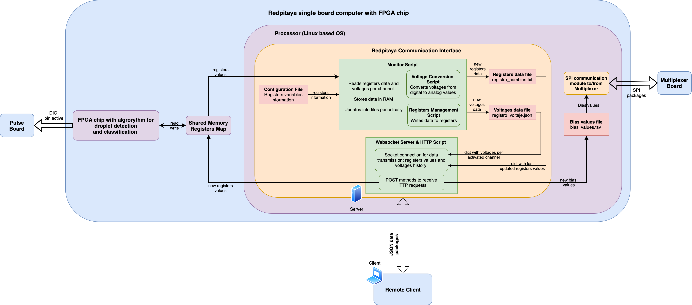

# Redpitaya Droplet Sorting System – Monitoring and Communication Interface

This repository branch contains the software running on the **Redpitaya processor (ARM-based Linux OS)**. It is **not** include the FPGA logic. Instead, it implements the communication interface and data handling for the Redpitaya system, based on a shared memory register map with the FPGA. It enables external control and monitoring of internal FPGA registers and system voltages via WebSocket and HTTP interfaces.

---

## Key Directories 

### rp-images/

The `rp-images` folder contains different versions of Redpitaya images that have been developed so far. These versions are backed up in case it is necessary to test a previous one, even though it is possible to generate new images using the resources available in the [Pyrpl repository](https://github.com/wenzel-lab/pyrpl/tree/updated-2025).  

The differences between each image lie in certain modifications made to the `red_pitaya_fads.sv` file, which is located in the Pyrpl repository mentioned above.


- `red_pitaya_uncompressed-updated-muxaddr.bit.bin`: The updated version (below) writing the `mux_addr_i` and `muxing_channels_o` variables to the memory space of redpitaya.
- `red_pitaya_uncompressed-updated-signal-duration.bit.bin`: The updated version (below) adding the `signal_duration` variable in `red_pitaya_fads.sv` file.
- `red_pitaya_uncompressed-updated-signed.bit.bin`: The updated version (below) considering as `signed` the voltages variables in `red_pitaya_fads.sv` file.
- `red_pitaya_uncompressed-updated.bit.bin`: Last version created from branch `open_fpga_fads` in [Pyrpl repository](https://github.com/wenzel-lab/pyrpl/tree/open_fpga_fads).  

To use a specific image on the Red Pitaya hardware, it must be placed in the `root/droplet-sorting-FPGA-controller/rp-images` directory and renamed to `red_pitaya_uncompressed.bit.bin`.

### communication-interface/

The `communication-interface` folder contains the files and scripts associated with the monitoring of the registers and voltages, and the implementation of the communication interface through a Websocket Server and HTTP protocol.

The documentation in this `README.md` refers mainly to the codes contained in this folder.

---

## Purpose

This implementation supports:

- Fast **monitoring of voltages and internal register values**
- File based **periodic logging** of voltages and register changes
- Remote **data acquisition and control** using a WebSocket connection and HTTP protocol

---

## System Architecture

The diagram below shows the architecture of the Redpitaya system, highlighting how the FPGA and processor interact through a shared memory and communication layers:




**Functional Components**:
- **FPGA Chip**: Implements the droplet detection and classification algorithm. It interacts with the Pulse Board through a digital I/O (DIO) pin that is activated. It also writes to the registers and reads the variables stored in them.

- **Shared Memory Register Map**: Acts as the communication interface between the FPGA and the processor. 

- **Redpitaya Processor Software**:
  - **Monitor Script** (`monitor.py`): Reads the register data and voltages, updates local variables stored in RAM if certain specified conditions are met and, periodically, these local variables are stored in files: `registers_data.txt` and `voltage_data.json`. There is a script `monitor_voltage_cycle.py` that has an extended version of `monitor.py`, since it considers the update of the variable that stores voltages locally only when the acquisition of voltages of all active channels has been completed, so it depends on the operation of the multiplexer module on FPGA.
  - **Voltage Conversion Script** (`voltage_conversion.py`): Converts digital register values to analog voltages.
  - **Registers Management Script** (`registers_management.py`): Implements a function to write values to the shared memory map.
  - **WebSocket and HTTP Server** (`websocket_server.py`):
    - WebSocket for continuous data transmission (last registers values and voltage signal fragment of each channel). The information to send is obtained from the files `registers_data.txt` and `voltage_data.json`.
    - HTTP server to receive remote POST requests for parameter updates and for sending the file with the historical values of the registers (`registers_data.txt`).

- **External Files**:
  - `registers_data.txt`: Stores the historical values of the registers.
  - `voltage_data.json`: Stores the last voltage signal fragment of each channel.
  - `bias_values.tsv`: Stores the bias voltages for each channel. These values are sent to the Multiplexer Board through SPI protocol.
  - **Configuration File** (`config.json`): File with the information of the registers and the variables associated with them.
- **External Boards**:
  - **Pulse Board**: Provides pulses for the Droplet Sorting System.
  - **Multiplexer Board**: Controlled via SPI from the processor for channel switching.

---

## Redpitaya Communication Interface Logic

This section details the functionality of the `monitor.py` and `websocket_server.py` scripts and their interaction within the Redpitaya communication interface, along with their interactions with relevant files.

### `monitor.py` Functionality

The `monitor.py` script is the core component responsible for real-time data acquisition and logging from the FPGA. Its primary functions include:

1.  **FPGA Register Access:** It utilizes memory-mapped I/O via the `/dev/mem` device file to directly read and interact with registers within the FPGA's memory space. This low-latency access is crucial for capturing real-time events and data.

2.  **Configuration Management:** The script loads its operational parameters from the `config.json` file. This file specifies which FPGA registers to monitor, their memory addresses, data types (signed/unsigned, voltage, bits, etc.), and how to interpret the raw register values.

3.  **Data Conversion:** It employs functions from the `voltage_conversion.py` module (`analog_voltage`, `analog_accum_voltage`) to translate raw integer values read from analog-to-digital converter (ADC) related registers into meaningful analog voltage readings. These conversion functions likely account for hardware-specific scaling and offsets.

4.  **FPGA Configuration:** The script uses the `registers_management.py` module, specifically the `write_register` function, to write configuration values to specific FPGA registers. This is used, for example, to set the signal duration for voltage acquisition and to enable or disable specific analog input channels.

5.  **Event Detection and Logging:** `monitor.py` continuously monitors key FPGA registers, such as the droplet detection ID. When a new droplet event is detected (indicated by a change in the ID) or when a change in relevant configuration parameters (like signal duration or enabled channels) occurs, the script reads all the variables defined in `config.json` and logs this snapshot of the system state as a JSON object into the `registers_data.txt` file. Each event or configuration change is recorded as a new line in this log file.

6.  **Analog Voltage Acquisition and Buffering:** The script reads the instantaneous voltage values from all available analog input channels. Based on the currently enabled channels (configured via an FPGA register), it stores these readings in a `deque` (double-ended queue) called `voltage_buffer`. This buffer maintains a history of recent voltage readings within a defined time window.

7.  **Periodic Voltage History Saving:** When the `voltage_buffer` becomes full (based on the configured sampling rate and time window), the script processes the buffer to organize the voltage readings per active channel and stores this historical voltage data as a JSON object in the `voltage_data.json` file. This saving operation is performed in a background thread to avoid blocking the main monitoring loop.

### `websocket_server.py` Script Functionality

The `websocket_server.py` script provides a web server interface (using FastAPI) to interact with the Redpitaya, offering both REST API endpoints for control and a WebSocket endpoint for data streaming.

1.  **REST API Endpoints:**
    -   **`/register` (POST):** This endpoint allows external clients to write specific values to FPGA registers. It accepts a JSON payload containing the register offset (in hexadecimal), the value to write (in decimal), and a boolean indicating if the value is signed. The script then uses the `write_register` function from `registers_management.py` to perform the write operation on the FPGA.
    -   **`/setgain` (POST):** This endpoint enables setting gain values for the bias values file. It receives a list of gain values in the request body and saves these values to the `bias_values.tsv` file. This tab-separated value file likely stores calibration or bias settings used by detectors.
    -   **`/download` (GET):** This endpoint allows clients to download the `registers_data.txt` file, providing access to the historical log of droplet detection events and configuration changes recorded by `monitor.py`.

2.  **WebSocket Endpoint (`/ws`):**
    -   This endpoint establishes a persistent, bidirectional communication channel between the server and connected clients.
    -   It continuously monitors the `registers_data.txt` and `voltage_data.json` files for new data.
    -   Upon detecting updates (specifically, the latest line in `registers_data.txt` and the entire content of `voltage_data.json`), it combines this information into a single JSON message.
    -   This combined JSON message, containing the most recent event log and the current voltage history, is then broadcast to all currently connected WebSocket clients at a regular interval (every 150 milliseconds). This provides clients with a near real-time stream of relevant system data.

### Interaction Between `monitor.py` and `websocket_server.py`

The `monitor.py` and `websocket_server.py` scripts collaborate to provide a comprehensive interface for monitoring and controlling the droplet sorting system. Their interaction primarily relies on the file system as an intermediary:

1.  **Data Generation and Storage (`monitor.py`):** The `monitor.py` script acts as the primary data acquisition agent, directly interacting with the FPGA hardware. It continuously reads real-time data related to droplet events and analog signals. This acquired information is then persistently stored in two key files:
    -   **`registers_data.txt`**
    -   **`voltage_data.json`**

2.  **Data Consumption and Distribution (`websocket_server.py`):** The `websocket_server.py` script acts as a server, providing interfaces for external clients to interact with the Redpitaya's data and control mechanisms. It consumes the data generated by `monitor.py` through the file system:
    -   **REST API for Control:** The `/register` endpoint enables clients to send control commands to the FPGA by writing specific register values. The `/setgain` endpoint allows for the modification of analog input bias values stored in `bias_values.tsv`.
    -   **WebSocket for Real-time Monitoring:** The `/ws` endpoint provides a data stream by continuously reading the latest event information from `registers_data.txt` and the current voltage history from `voltage_data.json`. This combined data is then pushed to all connected WebSocket clients, allowing for live monitoring of the system's state and analog signals.

3.  **File-Based Communication:** The `registers_data.txt` and `voltage_data.json` files act as the communication channel between the two scripts. `monitor.py` writes the acquired and processed data to these files, while `websocket_server.py` reads from these files to serve its REST API requests and to provide the data stream over the WebSocket connection.

In essence, `monitor.py` handles the low-level hardware interaction and data logging, while `websocket_server.py` provides a higher-level network interface for external clients to monitor the system and apply some control over its operation. The file system serves as a simple and effective way for these two crucial scripts to exchange information.

## Register Variables Description

The system uses a configuration file to define each variable information, such as associated register address and data type. This ensures readable and scalable communication between scripts and hardware.

|Variable Name|Register Address|Size|FPGA Data Type|Converted Data Type|Description|
|-------------|----------------|----|--------------|-------------------|-----------|
|`min_intensity_thresh`| `0x01000` to `0x01014` | `6` | `int`| `float` (mapped to analog voltage range)| Noise (peak) threshold detector (1-6)|
|`low_intensity_thresh`| `0x01020` to `0x01034` | `6` | `int`| `float` (mapped to analog voltage range)| Lower peak intensity sorting threshold for droplets (1-6)|
|`high_intensity_thresh`| `0x01040` to `0x01054` | `6` | `int`| `float` (mapped to analog voltage range)| Maximum peak intensity sorting threshold for droplets (1-6)|
|`min_width_thresh`| `0x01060` to `0x01074` | `6` | `int`| `int` | Noise (width = hwfm) threshold detector (1-6)|
|`low_width_thresh`| `0x01080` to `0x01094` | `6` | `int`| `int` | Lower peak width sorting threshold for droplets (1-6)|
|`high_width_thresh`| `0x010a0` to `0x010b4` | `6` | `int`| `int`| Maximum peak width sorting threshold for droplets (1-6)|
|`min_area_thresh`| `0x010c0` to `0x010d4` | `6` | `int`| `float` (mapped to accumulated analog voltage range)| Noise AUC threshold detector (1-6)|
|`low_area_thresh`| `0x010e0` to `0x010f4` | `6` | `int`| `float` (mapped to accumulated analog voltage range)| Lower AUC sorting threshold for droplets (1-6)|
|`high_area_thresh`| `0x01100` to `0x01114` | `6` | `int`| `float` (mapped to accumulated analog voltage range)| Maximum AUC sorting threshold for droplets (1-6)|
|`fads_reset`| `0x20` | `1` | `int`| `int`| Signal to reset the experiment values and classifier loops|
|`sort_delay`| `0x24` | `1` | `int`| `int`| Time needed to wait before triggering electrodes|
|`sort_duration`| `0x28` | `1` | `int`| `int`| Sorting AC pulse length|
|`signal_duration`| `0x100` | `1` | `int`| `int`| Duration of voltage signal fragment in UI (miliseconds)|
|`droplet_id`| `0x200` | `1` | `int`| `int`| Unique indetifier for each droplet|
|`cur_droplet_intensity`| `0x0204` to `0x0218` | `6` | `int`| `float` (mapped to analog voltage range)| Peak intensity data value of last completed droplet (1-6)|
|`cur_droplet_width`| `0x21c` to `0x230` | `6` | `int`| `int`| Width (fwhm) data value of last completed droplet (1-6)|
|`cur_droplet_area`| `0x234` to `0x248` | `6` | `int`| `float` (mapped to accumulated analog voltage range)| AUC data value of last completed droplet (1-6)|
|`cur_time_us`| `0x250` | `1` | `int`| `int`| Current time of the experiment (microseconds)|
|`droplet_classification`| `0x24c` | `1` | `bits`| `str`| Bit string indicating the FPGA state machine|
|`enabled_channels`| `0x300` | `1` | `bits`| `str`| Bit string indicating the enabled channels for the experiment|
|`droplet_sensing_addr`| `0x304` | `1` | `int`| `int`| Reference channel for droplet detection (range 0-5)|
|`update_cycle`| `0x10018` | `1` | `int`| `int`| Update cycle index to indicate that voltage measurement of all enabled channels is complete|
|`adc_values`| `0x30c` to `0x320` | `6` | `int`| `float` (mapped to analog voltage range)| Raw voltage values for each detector channel|
|`cur_adc_data`| `0x10000` to `0x10014` | `6` | `int`| `float` (mapped to analog voltage range)|Average current voltage data for each detector channel over the period of the multiplexer switching|
|`mux_addr`| `0x00104` | `1` | `int`| `int`| Current multiplexer address (range 0-5)|
|`mux_ch`| `0x00108` | `1` | `bits`| `str`| Bit string indicating the active channels for multiplexer|


You can modify the configuration file to update or expand the set of handled variables. This file is received at the beginning of monitor.py execution, so if it is modified, the mentioned script must be restarted.


## Getting Started

This section outlines the steps to get the communication interface software running on your Redpitaya.

1.  **Ensure Network Connectivity:**
    Before proceeding, ensure that your Redpitaya is connected to a network and that you can access it (e.g., via SSH). This is necessary for cloning the repository and installing dependencies. Verify your network configuration (IP address, gateway, etc.) as needed.

2.  **Clone the Repository:**
    First, clone the repository containing the code into the `/root/` directory of your Redpitaya. You can use the following command:

    ```
    cd /root/
    git clone git@github.com:wenzel-lab/droplet-sorting-FPGA-controller.git
    ```

    Then, checkout to the monitoring-logger branch:

    ```
    git checkout monitoring-logger
    ```

2.  **Verify FPGA Image:**
    Ensure that the FPGA bitstream image you intend to use is located within the `rp-images` directory of the cloned repository and is named `red_pitaya_uncompressed_bit.bin`. This file contains the hardware configuration for the FPGA.

3.  **Install Dependencies:**
    Navigate to the directory containing the `requirements.txt` file and install the necessary Python packages using pip:

    ```
    cd /root/droplet-sorting-FPGA-controller
    python3 -m pip install -r requirements.txt
    ```
    This command will install libraries such as `fastapi`, `uvicorn`, and potentially others required by the Python scripts.

4.  **Execution Order:**
    It is crucial to execute the scripts in the following order:
    -   First, run the `monitor.py` script. This script is responsible for direct interaction with the FPGA and data acquisition:
    ```
    cd /root/droplet-sorting-FPGA-controller/communication-interface
    python3 monitor.py
    ```
    -   Once `monitor.py` is running, execute the `websocket_server.py` script. This script provides the web server and WebSocket interface for external communication and relies on the data being generated by `monitor.py`:
    ```
    cd /root/droplet-sorting-FPGA-controller/communication-interface
    python3 websocket_server.py
    ```

## Loading Redpitaya Image Automatically on Startup

To make sure that the correct image is always loaded in the FPGA, we will create a service in init.d. The following steps are followed:

1. **Create .sh File:**
    In the `/opt/scripts/` folder create the following file `load_rp_image.sh`:

    ```
    #!/bin/bash
    /opt/redpitaya/bin/fpgautil -b /root/droplet-sorting-FPGA-controller/rp-images/red_pitaya_uncompressed.bit.bin 
    ```

    Grant executable permission to the file: `sudo chmod +x /opt/scripts/load_rp_image.sh`

2. **Create Script load_rp_image:**
  In the `/etc/init.d/` folder create the following file `load_rp_image`:

  ```                                       
  #!/bin/sh
  ### BEGIN INIT INFO
  # Provides:          load_rp_image
  # Required-Start:    $all
  # Required-Stop:     $all
  # Default-Start:     2 3 4 5
  # Default-Stop:      0 1 6
  # Short-Description: Load Red Pitaya FPGA image at startup
  # Description:       Script to load the FPGA image for Red Pitaya using FPGA manager
  ### END INIT INFO

  sleep 10
  # Path to image and load script
  IMAGE_PATH="/root/droplet-sorting-FPGA-controller/rp-images/red_pitaya_uncompressed.bit.bin"
  LOAD_SCRIPT="/opt/scripts/load_rp_image.sh"

  case "$1" in
    start)
      echo "Loading Red Pitaya image..."
      if [ -f "$IMAGE_PATH" ]; then
        sh "$LOAD_SCRIPT"
        echo "Red Pitaya image loaded."
      else
        echo "Error: Image file not found at $IMAGE_PATH."
      fi
      ;;
    stop)
      echo "Stopping Red Pitaya image loader (no specific action required)."
      ;;
    restart)
      $0 stop
      $0 start
      ;;
    *)
      echo "Usage: $0 {start|stop|restart}"
      exit 1
      ;;
  esac
  exit 0
  ```

  Grant executable permission to the file: `sudo chmod +x /etc/init.d/load_rp_image`

  3. **Register the Script for Autostart:**
      Use the `update-rc.d` command to register the script to run at boot:

      ```
      sudo update-rc.d load_rp_image defaults
      ```

  4. **Reboot to verify**
     Execute `sudo reboot` to verify that the image loads automatically at startup. You can verify the status with `sudo systemctl status load_rp_image`.

## Running Scripts Automatically on Startup as Services

To ensure that both `monitor.py` and `websocket_server.py` start automatically when your Redpitaya boots, you can configure them as systemd services. Follow these steps:

1.  **Create Service Unit Files:**
    You will need to create two service unit files, one for each script. These files define how systemd should manage the services. Create the following files:

    **`monitor.service` (located in `/etc/systemd/system/`)**

    ```
    [Unit]
    Description=Monitor Service
    After=load_rp_image.service network.target

    [Service]
    ExecStart=/usr/bin/python3 /root/droplet-sorting-FPGA-controller/communication-interface/monitor.py
    Restart=always
    User=root
    WorkingDirectory=/root/droplet-sorting-FPGA-controller/communication-interface

    [Install]
    WantedBy=multi-user.target
    ```

    **`websocket_server.service` (located in `/etc/systemd/system/`)**

    ```
    [Unit]
    Description=Webserver Service
    After=monitor.service network.target

    [Service]
    ExecStart=/usr/bin/python3 /root/droplet-sorting-FPGA-controller/communication-interface/websocket_server.py
    Restart=always
    User=root
    WorkingDirectory=/root/droplet-sorting-FPGA-controller/communication-interface

    [Install]
    WantedBy=multi-user.target
    ```

2.  **Enable the Services:**
    After creating the service unit files, you need to enable them so that systemd will start them on boot:

    ```
    sudo systemctl enable monitor.service
    sudo systemctl enable websocket_server.service
    ```

    Then, execute `sudo systemctl daemon-reload` to save the changes.

3.  **Start the Services (for the current session):**
    To start the services immediately without rebooting, use the following commands:

    ```
    sudo systemctl start monitor.service
    sudo systemctl start websocket_server.service
    ```

4.  **Verify Service Status:**
    You can check the status of the services to ensure they are running correctly:

    ```
    sudo systemctl status monitor.service
    sudo systemctl status websocket_server.service
    ```
    This will show you if the services are active, any recent logs, and any errors.


Now, assuming your Redpitaya has network connectivity, the `monitor.py` script will start automatically upon boot, followed by `websocket_server.py` after the network is up and the `monitor.service` has started. The `After=monitor.service` line in the `websocket_server.service` file ensure that `monitor.service` is started first.
